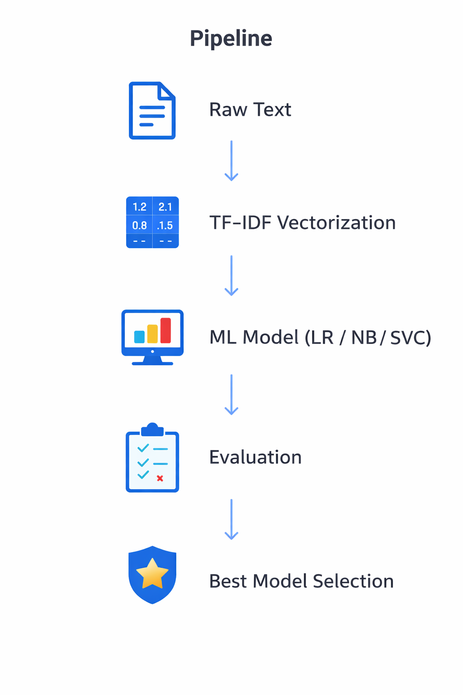
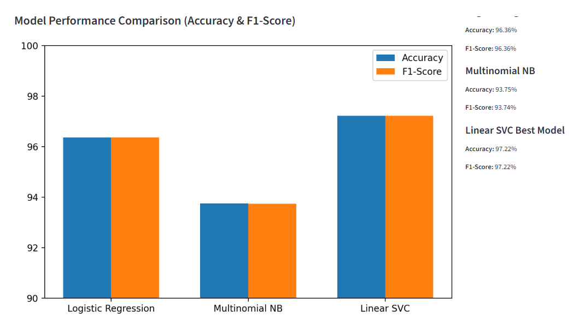
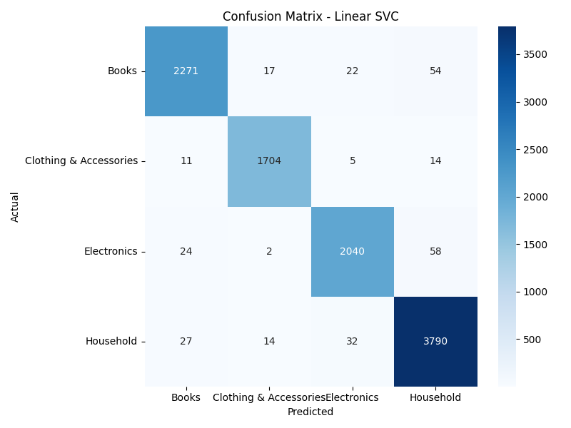

# E-Commerce Product Classification using ML & NLP

## Project Overview

This project builds an automatic product categorization system for e-commerce platforms using classical Natural Language Processing (NLP) techniques and supervised machine learning models.

The system classifies products into predefined categories based on:

- Product Title

- Product Description

The objective is to replace manual categorization with an accurate, scalable, and automated solution.

After comparing multiple machine learning algorithms, the best model achieved:

- 97.22% Accuracy

## Business Problem

E-commerce platforms manage thousands of products daily.  
Manual categorization is:

- Time-consuming
- Error-prone
- Expensive

This system automates product classification to improve scalability and efficiency.

E-commerce platforms handle thousands of new products daily.

Manual categorization is:

- Time-consuming

- Error-prone

- Not scalable

- Operationally expensive

Misclassified products can negatively impact:

- Search relevance

- Customer experience

- Conversion rates

- Recommendation systems

## Solution

This project provides an automated classification system that:

- Improves scalability

- Reduces human workload

- Ensures consistent categorization

- Enhances search & recommendation quality

## Dataset

Dataset source:  
[View Dataset on Kaggle](https://www.kaggle.com/datasets/saurabhshahane/ecommerce-text-classification)

### Dataset Characteristics

- Text-based dataset
- Multi-class classification problem
- Product Title + Description
- Balanced category distribution

### Target Variable

- Product Category

## Data Preprocessing

Data Preprocessing

The following preprocessing steps were applied:

- Lowercasing text
- Removing punctuation and special characters
- Removing stopwords
- TF-IDF Vectorization
- Train / Test split

### Why TF-IDF?

TF-IDF converts raw text into numerical feature vectors by:

- Penalizing common words  
- Emphasizing informative terms  
- Reducing noise  

## Methodology

Project's architecture :



## Model Comparison



Logistic Regression

- accuracy : 88%
- F1-Score : 87%

Multinomial NB

- accuracy : 85%
- F1-Score : 84%

Linear SVC

accuracy : 97.22%
F1-Score : 97.22%

## Confusion Matrix (Best Model)



The confusion matrix shows:

- Very low misclassification  
- High precision and recall across categories  
- Strong overall model stability  

## How to Run

```bash
python -m venv venv
source venv/bin/activate  # Mac/Linux
venv\Scripts\activate     # Windows

pip install -r requirements.txt
python src/train.py
python src/evaluate.py
